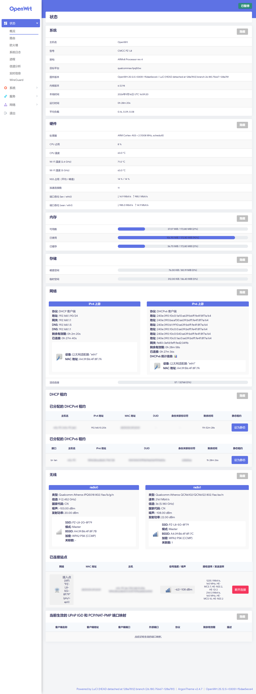
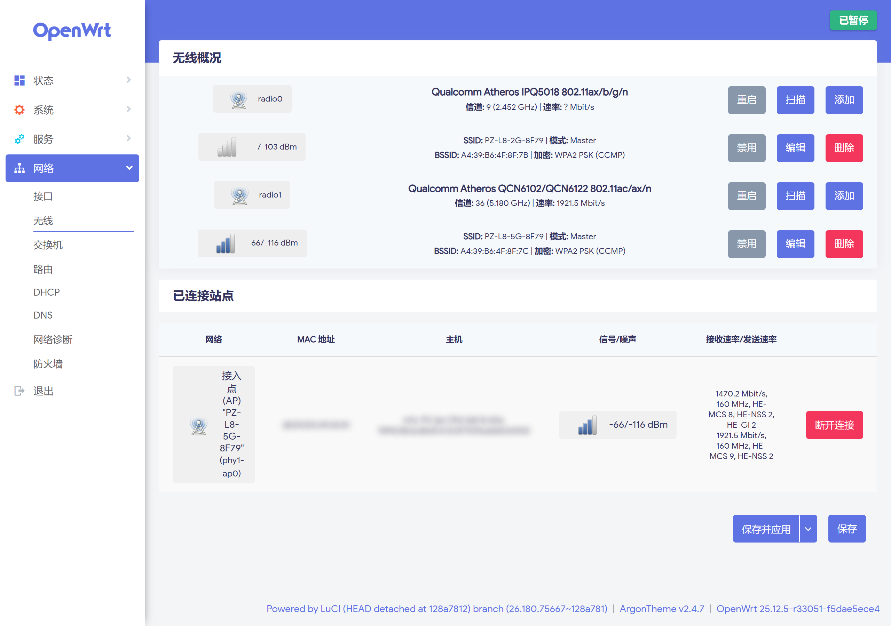
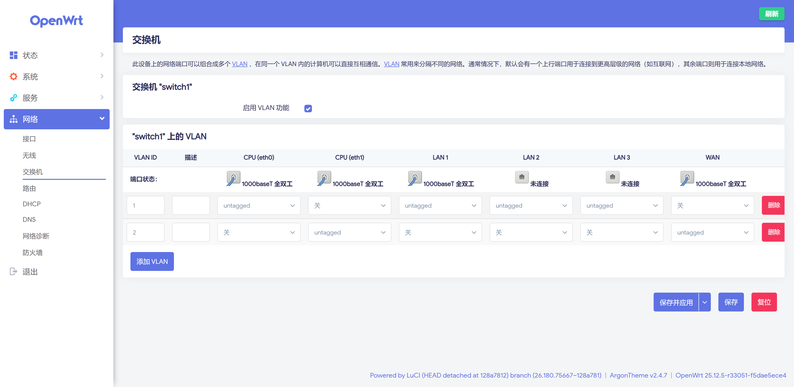

# CMCC PZ-L8 — 带 QSDK NSS 硬件卸载的 OpenWrt

**中文** | [English](README.en.md)

在**未修改的 OpenWrt 25.12.5 基线**（内核 6.12.94，aarch64）上为 CMCC PZ-L8
（IPQ5018 + QCA8337 + QCN6122）启用高通 NSS 硬件卸载。所有驱动直接取自高通官方
的 QSDK 14.0 源码，而不是某个厂商 SDK 分支。

有线和**两个射频**的转发都在 NSS 核内完成，包不进 Linux。

`main` 上每次构建成功都会发一个 [Release](../../releases)，含四个文件：

| 文件 | 用途 |
|---|---|
| `*-squashfs-sysupgrade.bin` | 升级已经在跑 OpenWrt 的路由器：`sysupgrade -n` |
| `*-uboot-recovery.fit` | `192.168.10.10` 的 U-Boot 网页恢复——**那个页面唯一接受的文件** |
| `*-squashfs-factory.ubi` | 从厂商固件强制 `sysupgrade -n -F`（对面用 `ubiformat` 写） |
| `*-initramfs-uImage.itb` | 从内存启动，不碰 flash |

---

## 实机实测

### 为什么要做这件事

原生 OpenWrt 在这块板子上用 DSA 走 Linux 转发路径。加上 NSS 之后：

| iperf3 `-P 4`，每方向 15 秒 | 本构建 | nwrt（闭源栈） | 原生 OpenWrt |
|---|---|---|---|
| **有线 ↔ WAN** | **949 上 / 949 下 Mbps，+0 % CPU** | 924 / 926 @ 4 % | **502 @ 100 % CPU** |
| **5 GHz ↔ WAN** | 510 上 / 438 下 Mbps，+0.3 % CPU | ~624 @ 25–35 % | 308 |
| **2.4 GHz ↔ WAN** | 58 上 / 61 下 Mbps，+0.3 % CPU | — | — |

CPU 指两个 Cortex-A53 主机核（NSS 的 UBI32 核独立，不计），且是**增量值**——
全程每秒采样 `/proc/stat`，减去同一次采集的空载基线，因为采样器自己就要吃
2–5 %。有线那一行落在基线上或以下：949 Mbps 的开销已经小到这个方法分辨不出来。

> 这张表是较早的一批，用的是 iperf3，而且 5 GHz 那行是在 NSS 固件从 12.2 换到
> 12.5**之前**测的。下面那张是后来重测的，测法不同，**两张表不能横向混读**。

### 三方同法对比

后来 v1.6 和 nwrt 都刷回这块板子实测了一遍——同一块板、同一个客户端
（一台 Intel AX201）、同一个服务端、同一个下午、同一套方法：四路并发 HTTP
每路 20 秒，用主机 `/32` 路由强制流量经过路由器。

| 四路并发 HTTP，20 秒 | v1.6 | nwrt | 本构建 |
|---|---|---|---|
| 有线 LAN → WAN | 912.1 | 901.8 | **912.6** |
| **5 GHz @ 160 MHz** | **730** | **722** | **697** |
| 5 GHz @ 80 MHz | — | — | 462 |
| 2.4 GHz @ 20 MHz | 98.8 | **119.4** | 75.0 |
| 2.4 GHz @ 40 MHz（`noscan`）| — | — | **112.5** |
| 5 GHz 传输时主机 CPU | 测不出，见下 | 16.1 % @ 537 | **2.9 % @ 441** |

两个参照都不是未改动的 OEM 固件：**v1.6** 是厂商 4.4 SDK 上的社区构建，
**nwrt** 是 5.4 上的社区构建，两者都用闭源 qca-wifi。

**有线三方打平**，都顶着客户端 1 Gbps 网卡的线速，测的是客户端不是路由器。

**5 GHz 在同宽度下相差 3.5–4.6 %。** 此前把差距归因于信道宽度只是推断
（722 / 425 ≈ 1.70，带宽比 2.0）；把本构建也开到 160 MHz 之后是实测：
462 → 697，涨 51 %，剩下的差距小到不需要另找原因。

**CPU 那一格现在才是同等条件比较**（同频段、同宽度、同测法，各自带空闲对照）：
nwrt 花 5.6 倍的 CPU 只多搬 22 % 的数据。v1.6 那格填不出数字，是因为它空闲时
CPU 就已经被四个卡死的 `hostapd_cli` 占满（load average 7.5，0 % idle）——
反过来这恰好佐证了转发没走主机 CPU：两个核被占满它仍然跑出 730 Mbit/s。

**2.4 GHz 是本构建唯一明确落后的一项。** 原因不是配置：AP 广播的是 2 流
MCS 0-11，固件也确实在用 2 流、20 MHz、0.8 µs GI，只是速率控制停在 MCS 6–7。
固件自己的统计给出了理由——13.5 % 的 MPDU 没被 ACK、22 % 重新入队、信道
44–58 % 被别人占着。同一套速率控制在安静得多的 5 GHz 上有 13 % 的帧跑在
MCS 9–11，所以它没坏，只是在回应一条真的在丢包的链路。完整推导见
[docs/WIFILI.md](docs/WIFILI.md)。

---

## 刷机

默认 LAN 地址是 **192.168.10.1**。

**已经在跑 OpenWrt** —— `sysupgrade -n <image>-squashfs-sysupgrade.bin`

**从厂商固件（如 v1.6）** —— 那边的 `platform_do_upgrade` 根本不读 sysupgrade
tar，它调 `do_flash_ubi`，也就是 `ubiformat`。所以要喂 **`.ubi`** 并加 `-F`：

```sh
sysupgrade -n -F <image>-squashfs-factory.ubi
```

**救砖 / U-Boot 网页恢复（`192.168.10.10`，开机按住按钮）** —— 这个页面执行的是
`imgaddr=$fileaddr && source $imgaddr:script`，所以它**只接受内含刷写脚本的
FIT**。上传 `.ubi` 会显示「成功」然后什么都不写。

```sh
curl -F "firmware=@<image>-uboot-recovery.fit" http://192.168.10.10/
```

两条路径、flash 布局、以及 bootloader 到底检查了什么，都在
[docs/RECOVERY.md](docs/RECOVERY.md)。原版 `platform.sh` 在这块板子上会中止
sysupgrade（它调 `elecom_upgrade_prepare()`，那个函数期待一对 A/B rootfs，
PZ-L8 没有），这里已打补丁。

### V2 批次：复旦闪存

这个型号有一批（V2）用的是复旦微 **FM25LS01** SPI-NAND，替代早期的 ESMT
F50D1G41LB。主线内核和 OpenWrt 25.12.5 都不认这颗的 ID——`fmsh.c` 里只有
FM25S01A（`0xE4`）和 FM25S01BI3（`0xd4`），所以 V2 板子上闪存根本认不出来。

本构建带了这一条：
`openwrt/tree/target/linux/generic/pending-6.12/440-mtd-spinand-add-support-for-FudanMicro-FM25LS01.patch`
（ID `0xA5`，2048 字节页 / 128 字节 OOB / 64 页每块 / 1024 块）。放 `pending-`
而不是 `backport-`，因为它还没进主线。顺带一提，`fmsh.c` 本身也不是内核自带的，
是 OpenWrt 的两个 generic backport（401、435）加进去的。

补丁取自 [CrazyBoyFeng/openwrt-pz-l8](https://github.com/CrazyBoyFeng/openwrt-pz-l8)，
再往上是 ImmortalWrt 的 `400-mtd-spinand-Support-fmsh.patch`，最初出自 Rockchip BSP。

**关于那个 ECC 数值。** 补丁声明 `NAND_ECCREQ(8, 512)`，而数据手册写的是片上
1-bit/512。这不是笔误：QPIC 控制器**不使用片上 ECC**，它按声明的强度去配自己的
硬件 ECC。本机 dmesg 就是这个机制的直接证据（我们这块是 ESMT，声明 1-bit）：

```
qcom_snand 79b0000.spi: ECC strength requirement of 1-bit(s) is unsupported, trying 4-bits
```

所以声明值决定 Linux 侧实际用几 bit，**必须和 U-Boot 写入时一致**，否则读不出
bootloader 写的 UBI（`-74 EUCLEAN`）。8 是补丁作者在自己 V2 板子上定的经验值。
**V2 刷完起不来并报 EUCLEAN 的话，第一个要看的就是这一行。**

**没有验证的部分：** 手上这块是 V1（dmesg 报 `ESMT SPI NAND was found`、OOB 64
字节），所以这条路径**只验证到「补丁干净应用、能编过」**，没在真实 FM25LS01
硬件上跑过；chip ID、几何参数、ooblayout 都照搬上游，没独立核对数据手册。
对 V1 板子的风险接近零——只是往芯片表里加一行，读到 ID `0xA5` 才生效。

---

## 开箱即用的无线配置

刷完就能连，不需要先进 LuCI 配一遍。

| | SSID | 信道 | 带宽 |
|---|---|---|---|
| 2.4 GHz | `PZ-L8-2G-XXXX` | 自动（ACS） | 申请 HE40，通常落在 20 MHz |
| 5 GHz | `PZ-L8-5G-XXXX` | 36 | **HE160（160 MHz）** |

加密 `psk2+ccmp`，密钥 `pzl8test2026`。`XXXX` 是本机 MAC 的后两字节（大写、无
分隔），首次启动时由 `/etc/uci-defaults/97-pzl8-wifi-ssid` 补上——和原厂固件同一
套命名方式，这样两块板子跑同一个镜像不会撞名。改成别的名字随意：那个脚本只动
它还认得出是出厂默认的名字。

### 两处你需要自己改

**密钥。** 这个镜像是公开发布的，所以这个密钥也是公开的——任何看过本仓库的人都
能连上还在用默认值的路由器。**先改它。**

```sh
uci set wireless.default_radio0.key='你的密钥'
uci set wireless.default_radio1.key='你的密钥'
uci commit wireless && wifi reload
```

**国家码，默认 `CN`。** 这不是可有可无的偏好：在默认的世界域（`country 00`）下，
`iw reg get` 把 5 GHz 切成 `5170-5250 @ 80` 和 `5250-5330 @ 80` 两个独立规则块，
上半段还是 DFS + 被动扫描，**根本不存在 160 MHz 信道**，radio1 会悄悄退回
80 MHz。设成板子实际所在的地区。

### 两个行为上的代价

**5 GHz 每次开机要等约一分钟。** CN 下 160 MHz 只有 5170–5330 这一段（中心
5250），它覆盖 DFS 频段，所以 hostapd 必须先做完信道可用性检查才发第一个信标：

```
hostapd: phy0-ap0: DFS-CAC-START ... cac_time=60s
hostapd: phy0-ap0: DFS-CAC-COMPLETED success=1 ... radar_detected=0
hostapd: phy0-ap0: interface state DFS->ENABLED
```

期间 5 GHz 不可见（2.4 GHz 不受影响，先起来），之后检测到雷达还会换信道。
这是这块板子上 160 MHz 的固有代价——5 GHz 里**任何**连续 160 MHz 信道都会伸进
DFS 频段，因为不含 DFS 的那两块一个 100 MHz、一个 125 MHz，都装不下。改成
`HE80` 可以免掉，代价是吞吐少三分之一（697 → 462）。

**2.4 GHz 通常跑在 20 MHz 而不是 40。** 配置里写的是 `HE40` 但没加 `noscan`，
所以 802.11 共存扫描发现周围有重叠 BSS 时会自动退回 20 MHz——两个参照固件是
完全一样的做法。想强制 40 MHz：

```sh
uci set wireless.radio0.noscan='1'
uci commit wireless && wifi reload
```

实测约 +50 %（75.0 → 112.5 Mbit/s），代价是无视周围 25 个网络的共存请求，多出来
的空口时间是从它们那里拿的。**默认不开。**

---

## 网页界面

### 状态页上的硬件读数



整页截于**转发 985 Mbit/s 时**。本构建新增的是其中的「硬件」一节：CPU 占用 8 %、
NSS 占用 14 %、11 条加速连接，两个口一进一出各跑满千兆。数据面在 NSS 核里，主 CPU
基本是闲着的——这一节存在的意义就是让这件事看得见。图里被涂抹的只有 DHCP 租约和
已连接站点两处表格中的客户端主机名、MAC、DUID 和地址。

原版 LuCI 的「概览」不显示 CPU 型号、温度和加速引擎占用。数据源一直都在，缺的
只是展示层，所以这个构建补了一节：

| 显示项 | 数据源 |
|---|---|
| 处理器 | `/proc/device-tree/cpus/cpu@0/compatible` + cpufreq（aarch64 的 `/proc/cpuinfo` 没有 `model name`） |
| CPU 占用 | `/proc/stat` 两次采样求差，在浏览器侧算 |
| CPU 温度 | `/sys/class/thermal/` 里 type 含 `cpu` 的热区 |
| Wi-Fi 温度 | `/sys/class/hwmon/` 里名为 `ath11k_hwmon` 的项，每个 radio 一个 |
| NSS 占用 | `/sys/kernel/debug/qca-nss-drv/stats/cpu_load_ubi` |
| 加速连接数 | `/sys/kernel/debug/ecm/ecm_db/connection_count` |
| 端口吞吐 | `nss-dp` 网口的 netdev 字节计数，两次采样求差 |

三个文件，不改 LuCI 自带的任何东西：

```
files/usr/libexec/rpcd/luci.pzl8                       rpcd 插件，一次调用返回全部
files/usr/share/rpcd/acl.d/luci-pzl8.json              只授予读取该方法的权限
files/www/luci-static/resources/view/status/include/15_pzl8_hardware.js
```

状态页的 `index.js` 用 `fs.list()` 列出 include 目录再逐个加载，所以**丢一个文件
进去就会被自动收录**，不需要像 nwrt 那样改写上游的 `10_system.js`。用 rpcd 插件
而不是在前端做若干次 `fs.read`，是因为这页每几秒轮询一次、每次文件读取都是独立
的 ubus 往返；另外 `cpu_load_ubi` 在 debugfs 里只有 root 读得到，而 rpcd 本来
就是 root。

几条不那么显然的实现选择：

- **是 NSS 不是 NSS/PPE。** PPE（包处理引擎）是 IPQ807x / IPQ60xx / IPQ95xx 那条
  线的硬件块，**IPQ5018 上没有**。
- **速率取 `eth0`/`eth1` 的 netdev 计数，不取 `br-lan`。** 实测过：一次传输里两个
  网口各走了 989 Mbit/s，而同一时间 `br-lan` 只看到 52——被加速的流量根本不经过
  Linux 网桥。
- **Wi-Fi 温度按设备树节点标注，不按 phy 编号。** phy 编号不稳定，一次
  `wifi reload` 就能让 2.4G 从 phy0 变成 phy1（实测过），而 `c000000.wifi` /
  `b00a040.wifi` 不会动。
- **速率的时间间隔是实测的**（`Date.now()` 之差），不是假设轮询间隔；计数器出现
  负增量（接口 down 过）时显示为未知而不是负数。

**端口归属是问 netifd，不是猜的。** 最初这里用「默认路由在哪个口」判定 WAN，
那样**只在 WAN 直接挂在物理口上时成立**：PPPoE 时默认路由在 `pppoe-wan`、VLAN
拨号时在 `eth1.2`，两者都不是 nss-dp 口，结果所有口都会落回 LAN；纯 AP 模式下
压根没有默认路由。现在一个口被某个接口认领的条件是：它是该接口的 `device`、
是那个 `device` 的一个 VLAN、或是那个 `device` 网桥的成员。关键在于 **netifd 的
`device` 始终是二层设备**——在设备上验过，一个挂在 dummy 上的 PPPoE 接口报的是
`device = pppdummy` 而 `l3_device` 为空。**没有任何东西被假定叫 wan 或 lan，
也没有假定它们存在**；没被认领的口照样显示，用自己的设备名。

### 另外两页



radio0 是 IPQ5018 内置的 2.4 GHz，radio1 是 QCN6122 —— **两个射频都在跑，都已
卸载到 NSS**。5 GHz 停在 36 信道 160 MHz，「已连接站点」里那行 `160 MHz,
HE-MCS 10, HE-NSS 2` 是**每站点**的协商速率，这一项需要改驱动才拿得到，见
[docs/WIFILI.md](docs/WIFILI.md)。客户端的 MAC 和主机名做了涂抹处理。



这一页是「把 DSA 换成 `qca-ssdk` + swconfig」之后的样子：**`CPU (eth0)` 和
`CPU (eth1)` 两列并存**，也就是两个独立的 GMAC 各自成为一个 CPU 口，而不是 DSA
那样只绑一个上行、另一个白白浪费。端口 MTU 是 1500，没有 DSA tag。理由见
[docs/FINDINGS.md](docs/FINDINGS.md) 第 1 节。

### 界面语言

镜像内置中文：`luci-i18n-base-zh-cn` 等四个包，加上本构建自己的 `pzl8.zh-cn.lmo`
（上表那几条标签）。首次启动时 `/etc/uci-defaults/96-pzl8-luci-lang` 把
`luci.main.lang` 设为 `zh_cn`，**只在它还是出厂默认值 `auto` 时才设**——你在
「系统 → 语言」里改过之后，sysupgrade 保留配置时这个脚本会再跑一遍，但不会把你
的选择改回去。想跟随浏览器语言：`uci set luci.main.lang=auto`。

msgid 保持英文、中文放在 catalog 里，所以英文界面下这一节仍然是英文，不是写死的
中文。翻译源是 `po/pzl8.zh-cn.po`；仓库里同时放了编译好的 `.lmo`，因为构建过程
只是拷贝 `files/`，没有编译 `.po` 的环节。改完 `.po` 后：

```sh
po2lmo po/pzl8.zh-cn.po files/usr/lib/lua/luci/i18n/pzl8.zh-cn.lmo
```

`po2lmo` 是 luci-base 的宿主工具，在 OpenWrt 构建树的 `staging_dir/hostpkg/bin/`
下。服务端把 `/usr/lib/lua/luci/i18n/` 里该语言的**所有** `.lmo` 合并后一次性
下发，所以放一个文件进去就够了。

---

## 已经可用的部分

- NSS 核正常启动，ECM 卸载栈每次开机自动加载
- 外置 QCA8337 由 `qca-ssdk`/swconfig 驱动而非 DSA——两个独立 GMAC，MTU 1500，
  无 DSA tag
- ath11k 双频 WiFi，**两个射频都已卸载**；5 GHz 默认 160 MHz
- 每个射频多个 SSID、`option isolate`、以及 `iw station dump` 里的每站点接收
  速率——这几项都需要改驱动，见 [docs/WIFILI.md](docs/WIFILI.md)
- SQM 能真正整形（`sqm-scripts-nss` + NSS qdisc），但**默认不装**，见下
- macvlan 做 WAN 口多拨，并且**被 NSS 加速**——必须 `option mode 'private'`，
  ECM 只认这一种模式，见 [docs/FINDINGS.md](docs/FINDINGS.md)
- 状态 LED、WAN DHCP、LuCI（中文）、sysupgrade

## 已知限制

- **SQM 默认不装。** 勾一个 `sqm-scripts` 会拖进 18 个包——cake、ifb、tc，以及
  `iptables-nft` 那一整套 xtables 兼容层——而这台机器上 fw4 是 nftables 原生、
  数据面又在 NSS 里，那些包除了伺候 SQM 别无用处。要用就在 menuconfig 里勾
  **`sqm-scripts-nss` 一个包**，依赖会自动补齐，包括两个 NSS 内核模块
  （`kmod-qca-nss-drv-qdisc`、`kmod-qca-nss-drv-igs`）。
- 装上之后，**QoS 必须选 `nss-edma` 这个脚本**：数据路径在 NSS 核里，Linux 的
  qdisc 根本看不到流量，cake 或 fq_codel **会静静地什么都不做**。见
  [docs/WIFILI.md](docs/WIFILI.md)。
- **内存紧张。** 256 MB 的板子，MemTotal 只有 173 MB——预留里有 48 MB 是 Q6 无线
  固件，无法缩减——剩下的里 ath11k 又占 46 MB。ath11k 的数据路径环已经从上游
  尺寸调小，否则和 NSS 放不下。
- 射频的 monitor 模式抓包实际上被那些环尺寸禁掉了。
- **防火墙里的流量分载开关在这里什么都不做。** 硬件分载是 `[fixed]` 关闭——
  `qca-nss-dp` 没有 flowtable 支持；软件分载则是空转，因为 ECM 在 netfilter 转发
  路径看到连接之前就把它交给了 NSS。实测：开启后 flowtable 接到零条连接，而 NSS
  照常加速。两个都保持关闭。
- 2.4 GHz 吞吐低于两个参照固件，原因见上文「三方同法对比」。
- **5 GHz 的信道分析在 160 MHz 下用不了。** 5 GHz 里不存在不含 DFS 的 160 MHz
  块，而 mac80211 在信道上下文启用了雷达检测时会拒绝扫描（`iw scan` 直接
  `Resource busy`），所以 LuCI 的「信道分析」在 5 GHz 上只看得到自己。要扫全频段，
  先把 radio1 降到 HE80（36–48 或 149–161），扫完再切回去。2.4 GHz 没有 DFS，
  不受影响。
- **雷达会把 5 GHz 打回 80 MHz，而且不会自己回来。** 30 分钟静默期到期、
  `wifi reload`、运行时信道切换都不行，只有 `wifi down radio1 && wifi up radio1`
  能重新跑 CAC（实测 64 秒，期间只有 5 GHz 断）。**静默期内重启射频会让 5 GHz
  完全起不来**，别在那时候动它。自动恢复的看门狗写过，因为一分钟断线的代价比停在
  80 MHz 更大而弃用。
- **「实时信息 → 无线」的 Phy Rate 在高速率下是错的。** 数据源 `luci-bwc` 把速率
  存在一个 `uint16_t` 里（单位 kbit/s，上限 65.5 Mbit/s），1921.5 Mbit/s 会回绕成
  20 Mbit/s；噪声低于 -100 dBm 也一律显示 -100。两个都是 LuCI 上游的问题。另外
  这一页画的是**关联客户端**的信号和速率，没有客户端时全是 0 属于正常。
- `qca-ssdk-shell`（`ssdk_sh`）编译不过——`-fPIC` 穿不过它的递归 make 传不到
  `src/sal/sd`。

---

## 构建

### GitHub Actions

`main` 上每次构建成功都会发布一个 [release](../../releases)。镜像同时也作为 run
artifact 附在构建上，但 artifact 会过期，release 不会。Pull request 会构建但不
发布；手动运行 **Build CMCC PZ-L8 (NSS)** 时可以取消勾选 `make_release`。

U-Boot 恢复 FIT 由 CI 用同一次构建出的 factory 镜像现做，并且**超过 bootloader
的 32 MiB 上限就让构建失败**——与其发布一个到用的时候才被拒的文件，不如当场报错。

CI 还会 clone [luci-theme-argon](https://github.com/jerrykuku/luci-theme-argon)
到 `package/` 并编进镜像。它**不在** OpenWrt 的 luci 源里——v25.12.5 锁定的那个
revision 只有 bootstrap / material / openwrt / openwrt-2020——所以在种子配置里写
`CONFIG_PACKAGE_luci-theme-argon=y` 没有用：任何没有这个包的树上，defconfig 都会
**静默丢掉**它，镜像照样编出来，只是没有主题。

这一步**只在 CI 里做，不在 `setup.sh`**：那个脚本的职责是把本项目应用到一棵树上，
本地构建不该去联网 clone 一个你没要求的第三方仓库。本地也想要就自己来：

```sh
git clone --depth 1 https://github.com/jerrykuku/luci-theme-argon \
    openwrt/package/luci-theme-argon
cd openwrt && make menuconfig     # LuCI → Themes 里勾上
```

跟的是 master、不锁 commit，所以每次构建实际用的那个提交记在 `build-info.txt`
的 `argon_commit` 里——「最新」回答不了「这个镜像里装的是哪个」。

装上之后主题不会自动切换，在「系统 → 语言和界面」里选，或者：

```sh
uci set luci.main.mediaurlbase='/luci-static/argon'
uci commit luci
```

### 本地

```sh
git clone https://github.com/openwrt/openwrt -b v25.12.5
git clone https://github.com/mufeng05/openwrt-cmcc-pz-l8-nss pzl8-nss
pzl8-nss/scripts/setup.sh ./openwrt
cd openwrt && make -j$(nproc)
```

`setup.sh` 是幂等的，并且会把自己动过的东西都打印出来。

### 自己选包

`setup.sh` 跑完之后，这就是一棵普通的 OpenWrt 源码树：

```sh
cd openwrt
make menuconfig        # 加 LuCI 应用、工具，想加什么加什么
make -j$(nproc)
```

`setup.sh` 只在**没有** `.config` 时才播种配置，所以为了拉新提交而重跑它不会丢掉
你的选择。`RESEED=1 pzl8-nss/scripts/setup.sh ./openwrt` 则是明确要求回到仓库自带
的配置。两种情况它都会以 `make defconfig` 结尾，所以上游新增的包会被补上默认值。

有几个符号必须保持开启，而 menuconfig 不会拦着你关掉——其中两个根本不是包：

| | |
|---|---|
| `CONFIG_NSS_DRV_WIFIOFFLOAD_ENABLE` | 编译 qca-nss-drv 的 wifili 和 wifi_vdev 那一半。没它 `ath11k.ko` **链接不了**——modpost 报十个未定义的 `nss_wifili_*` 符号 |
| `CONFIG_NSS_FIRMWARE_VERSION_12_5` | 选定固件 blob，**并且**通过 qca-nss-drv 的 0022 补丁选定 wifili 消息 ABI。关掉它**编译照样过**，但 peer 统计数组步长会比固件发的短 16 字节 |
| `CONFIG_PACKAGE_kmod-qca-nss-drv` | NSS 驱动本体 |
| `CONFIG_PACKAGE_nss-firmware-ipq50xx` | 固件 blob |
| `CONFIG_LUCI_LANG_zh_Hans` | 中文界面。注意**不能**直接写 `CONFIG_PACKAGE_luci-i18n-*-zh-cn=y`：那些是 `HIDDEN` 符号，存不住种子里的值，defconfig 会丢掉它们并按默认重算 |

想把你的选择固化进仓库，写回种子配置即可：

```sh
cd openwrt
./scripts/diffconfig.sh > ../pzl8-nss/config/cmcc_pz-l8.config
```

workflow 在 `defconfig` 之后会重新校验这些符号，所以种子要是丢了哪个，会在几秒内
报 `MISS <symbol>`，而不是四十分钟后死在 modpost——或者发出一个「构建成功、界面
却是英文」的镜像。

---

## 目录结构

```
config/          .config 种子（diffconfig 输出）
docs/            工程笔记——先看 FINDINGS.md；img/ 是 README 里的截图
feed/            本项目的包：qca-nss-drv、-ecm、-clients、qca-mcs、
                 nss-firmware、ipq-wifi、qca-ssdk-shell
files/           rootfs 覆盖层：nss-offload 启动脚本、LuCI 硬件读数、中文 catalog
manifest/        这些源码锁定到的 QSDK 14.0 revision
po/              LuCI 翻译源（编译成 files/ 下的 .lmo）
openwrt/
  0001-*.patch   对 OpenWrt 已有文件的修改
  tree/          OpenWrt 没有的文件，原样拷贝
scripts/setup.sh 把以上全部应用到一棵干净的源码树
scripts/mkrecovery.py  从 factory.ubi 生成 U-Boot 恢复 FIT
```

## 源码为什么锁在这些版本

- **NSS 驱动 / ECM / mcs**：QSDK 14.0（`NHSS.QSDK.14.0.r9-00040-O`），来自
  git.codelinaro.org。
- **NSS clients**（pppoe、qdisc、vlan-mgr）：QSDK **12.5.5**。QSDK 14 的 client
  feed 是纯 PPE 的，而 IPQ5018 没有 PPE 模块——高通自己的 `nss-ppe/Makefile` 里
  只列了 ipq52xx/53xx/54xx/95xx/96xx。
- **NSS 固件**：`NSS.FW.12.5-210-MP.R`，以及与之匹配的 wifili ABI。坑在于
  **blob 不能单独换**——qca-nss-drv 的 0022 补丁把四个 `uint32_t` 藏在
  `NSS_FIRMWARE_VERSION_12_5` 后面，而且它们全在 peer 统计消息的**每-peer 数组
  内部**，所以选固件必须连 ABI 一起选，否则第一个 peer 之后的每一个都会读错
  偏移。选 12.5 的依据是自测：两轮 A/B，WiFi 中位数 253 → 417 Mbit/s，分布不
  重叠。兼容 mesh 的仍然只有 11.4 这条线。
- **数据平面**：OpenWrt 自带的 `qca-nss-dp`（`syn_gmac_dp`），和原厂固件用的是
  同一个驱动。没用 `qca-dwmac-nss` 这层 shim：那是给把 ipq50xx 改成上游 stmmac
  的树用的，本项目不是那种情况。

## 致谢

QSDK 源码属于高通，来自 <https://git.codelinaro.org/clo/qsdk>。

打包骨架和大量 kernel 6.x 修复来自社区 NSS feed，均为 GPL：

- Julius Bairaktaris —— <https://github.com/JuliusBairaktaris>。`nss-packages`
  源头在他这里；而 `openwrt-nss-edma`——本项目在 `docs/WIFILI.md` 全程对照的那棵
  树——也是他的。`openwrt/tree/` 里的 iproute2 NSS qdisc、nssmirred 补丁以及多个
  qualcommax 内核补丁同样带着他的 Signed-off-by。
- Stanislaw Pal（kuncy7）—— <https://github.com/kuncy7>。本项目对这两棵树的
  checkout 用的是他的 fork。
- Sean K（qosmio），NSS 固件 blob 的重新打包者 ——
  <https://github.com/qosmio/qca-sdk-nss-fw>
- CrazyBoyFeng —— <https://github.com/CrazyBoyFeng/openwrt-pz-l8>，FM25LS01
  闪存补丁出自这里。

ath11k 缩环的做法参考了 <https://github.com/openwrt/openwrt/pull/21495>，
该 PR 未被合并。
